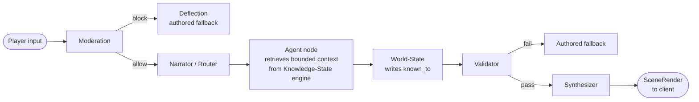
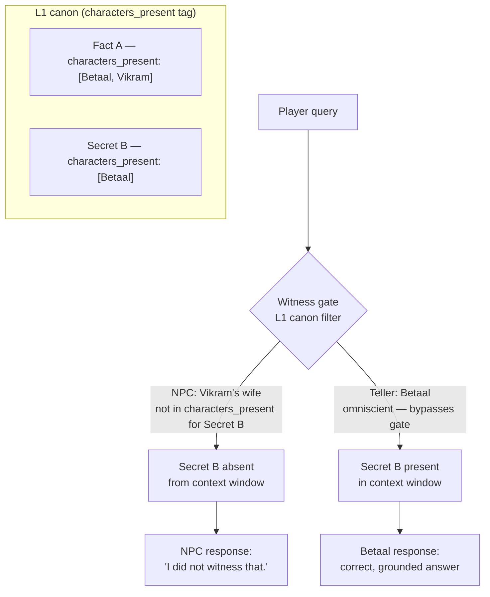

<div align="center">

# Katha

**A multi-agent narrative engine where each AI character can only retrieve facts it personally witnessed — information-asymmetry enforced in the retrieval layer, not by prompt instructions, and proven leak-proof by an automated eval suite.**

[](https://arrya5-katha.hf.space)

[](https://github.com/arrya5/KATHA/actions/workflows/ci.yml)


</div>

*Play it in your terminal or browser in under 60 seconds — no API keys required.*

> **▶ Play it live (no install, no key):** **[arrya5-katha.hf.space](https://arrya5-katha.hf.space)**

---

### Why this is technically interesting

Most multi-agent demos share a single global context, meaning any agent can be prompted to surface any fact — leakage is a social contract enforced only by the system prompt, which any jailbreak or paraphrase can break. Katha takes a different approach: **if the secret never enters an agent's context window, no decoding path can emit it.**

The core mechanism is a **witness gate** applied at retrieval time. Every canon fact in the knowledge base is tagged with `characters_present` (the agents who witnessed that event). When an NPC queries the knowledge state, L1 retrieval filters on that metadata — the secret is structurally absent from the context, not merely discouraged. The OMNISCIENT narrator Betaal bypasses the gate and can see all facts, which is both the story mechanic and a clean test oracle for the guarantee.

This makes leakage provably impossible at the retrieval layer rather than probabilistically suppressed at the prompt layer — a meaningful engineering distinction in any system where agents must hold asymmetric information.

---

## Quickstart

Zero installations beyond Python 3.12. Zero API keys.

```bash
git clone https://github.com/arrya5/KATHA.git
cd KATHA/backend

# 1. Run the full self-test (knowledge-leak guarantees, moderation evals, full story arc)
python -m app.selftest

# 2. Play the complete story arc in your terminal
python -m app.demo

# 3. Play in your browser (interactive visual novel UI)
python -m app.webserver
# Open http://127.0.0.1:8000
```

To verify the leak-proofness metric directly:

```bash
python -m app.eval_leak
# Prints the adversarial probe results and exits 0 if the invariant holds
```

Mobile (optional): `cd frontend && npm install && npm start` — scan the QR code with Expo Go on a real device. Your phone and computer need to be on the same Wi-Fi network.

---

## Architecture

### Turn graph (6 nodes)



Runs on a stdlib runner (zero extra installs) or LangGraph (`KATHA_ORCHESTRATOR=langgraph`) — same node functions, swappable wiring.

### The witness gate (knowledge isolation)



---

## The witness gate (knowledge isolation)

The engine uses three retrieval layers:

| Layer | What it indexes | Gate |
|---|---|---|
| L1 — witnessed canon | Hard facts from the tales (story beats, secrets) | `characters_present` — only agents who were there get the fact |
| L2 — world events | Events that happened during gameplay | `known_to` — written at event time; only witnesses get it |
| L3 — per-agent memory | Each agent's own conversational history | No cross-agent access by construction |

**This is enforced in code, not in a prompt.** The gate lives in `backend/rag/knowledge_state.py`. An agent cannot retrieve a fact that was never added to its retrieval set, regardless of what the LLM is told or how the user phrases the question.

Proof from `python -m app.selftest`:

```
Knowledge-leak (L1 witnessed canon):
  [PASS] Betaal (teller) can access the secret fact
  [PASS] The wife CANNOT access the secret she didn't witness
```

Running `python -m app.eval_leak` probes the full adversarial set:

```text
  LEAK-PROOFNESS (security invariant -- gates this run)
    forbidden facts withheld from non-witnesses : 28/28
    information leaks                           : 0
  RESULT: 28/28 secrets withheld across the probe set -- 0 leaks. Leak-proof by construction.
```

> **0 information leaks across the full 28-probe adversarial set** — the guarantee is enforced in the retrieval layer, not requested in a prompt.

---

## What runs offline vs. what a key adds

A fair question for any "runs offline" AI project: *if there's no LLM, what is actually running?* The honest answer — **the mock provider replaces exactly one thing, final dialogue generation. The architecture runs identically with or without a key.**

| Component | Offline (mock, default) | With a key / local model |
|---|---|---|
| 6-node agent graph, rule-based router, world-state, validator | ✅ Runs for real | ✅ Identical |
| 3-layer retrieval + **witness-gated knowledge isolation** | ✅ Runs for real — the leak-proof guarantee | ✅ Identical |
| Retrieval similarity | Lexical (token-overlap), zero-dependency | Dense-vector via Ollama embeddings, or Chroma / Pinecone |
| Dialogue text | Authored line returned verbatim (deterministic, testable) | Generated in-character from the bounded context |

The split is deliberate: **the knowledge-isolation guarantee is enforced in code, so it holds regardless of whether — or how well — the LLM behaves.** `app.eval_leak` proves 0 leaks against the mock; setting `KATHA_LLM_PROVIDER=gemini` (or `ollama`, free and local) feeds the *same* witness-filtered context into live generation. What changes is prose quality, not the invariant. That is the point of moving the boundary into the retrieval layer rather than the prompt.

---

## Tech stack

| Layer | Choice |
|---|---|
| Language | Python 3.12 |
| Agent orchestration | 6-node turn graph; stdlib runner (default) + LangGraph (production) |
| RAG | 3-layer (L1 witnessed canon / L2 world-events / L3 memory); lexical default, Ollama semantic optional |
| LLM providers | Mock (offline, deterministic, zero keys) / Ollama (local) / Gemini (cloud) — provider-swappable via one env var |
| Moderation | 3-layer: input classifier → output validator → authored-fallback safety net |
| Persistence | In-memory (default) / SQLite (`DATABASE_URL=sqlite:///katha.db`) |
| Analytics | Best-effort telemetry → Supabase (Postgres via PostgREST, stdlib `urllib` only) / SQLite fallback; `app.stats` CLI |
| Client | Browser (stdlib HTTP + `web/index.html`) / Expo + React Native (mobile) |
| Voice | Sarvam TTS (key-gated, plug-and-play); browser TTS fallback offline |
| Deploy | Dockerized Hugging Face Space; one-command redeploy (`scripts/deploy_hf.sh`) |

---

## Tests & evals

| Command | What it covers |
|---|---|
| `python -m app.selftest` | Knowledge-leak invariants (witnessed-canon gate, world-event gate); moderation red-team inputs (40/40 caught); moderation false-positive set (20/20 allowed); full story arc end-to-end |
| `pytest backend/tests/` | Unit and integration tests for engine nodes, RAG layers, and persistence |
| `python -m app.eval_leak` | Adversarial probe suite (28 probes) — systematically attempts to extract secrets through every NPC; reports leak count and exits 0 if 0 leaks (currently 28/28 withheld, 0 leaks) |

All three run offline with the mock LLM provider. The eval suite is the canonical proof of the knowledge-isolation guarantee.

---

## Analytics (player telemetry)

Real usage is measured, not guessed — via a best-effort telemetry pipeline that records how people actually play without ever slowing or breaking a turn:

- **Never blocks or breaks a turn.** Events drop onto a bounded in-memory queue and flush on a daemon thread; every failure (network, disk, bad config) is swallowed and logged at DEBUG. A dead analytics backend is invisible to the player.
- **Durable, zero new dependencies.** Writes to Supabase (Postgres) over its PostgREST REST endpoint using only stdlib `urllib` — matching the project's zero-install ethos. Falls back to local SQLite for offline dev, or no-ops entirely when unconfigured.
- **Derived metrics, never hand-maintained.** `python -m app.stats` turns the append-only event log into unique / returning players, session funnel, per-tale completion rate, median turns per session, and intent mix.

Five event types (`session_start`, `tale_start`, `turn`, `tale_complete`, `season_complete`) carry a stable per-person `player_id` (browser `localStorage`), so returning-player retention is measurable — distinct from a per-page-load session id. Credentials live only in environment variables / Hugging Face Space secrets, never in the repo or client.

```bash
python -m app.stats          # human-readable summary
python -m app.stats --json   # machine-readable (dashboard / badge)
```

---

## Vision

Katha is a cultural-preservation project as much as a game. The goal is to bring Indian mythology to life in a form that respects the source texts and is rigorous enough to survive scrutiny from scholars and the community alike. **Phase 1** (shipping now) is Vikram aur Betaal — low-risk folklore whose riddle-and-moral structure maps cleanly onto the investigation gameplay loop. **Phase 2** is the Mahabharata, gated behind a cultural-review checklist, an advisory board, and proven retention from Phase 1. The engine is content-agnostic; Phase 2 design is preserved, not wasted.

---

## Technical writeup

[**Leak-proof AI agents: information asymmetry in a multi-agent RAG game**](docs/blog/leak-proof-agents.md) — why prompt-level "don't reveal X" fails, and how moving the boundary into the retrieval layer makes leakage structurally impossible (with the invariant test that proves it).

---

## Author

**Arrya Thakur** — SRM Chennai CS '27

MIT License — see [LICENSE](LICENSE) for details.

Contributions welcome — see [CONTRIBUTING.md](CONTRIBUTING.md) for guidelines.
